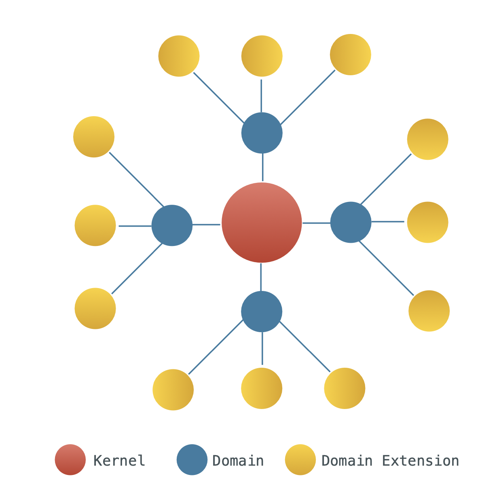
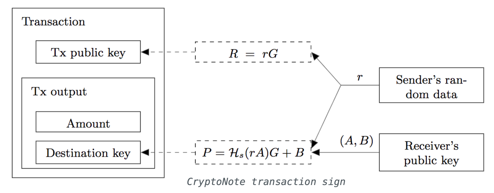
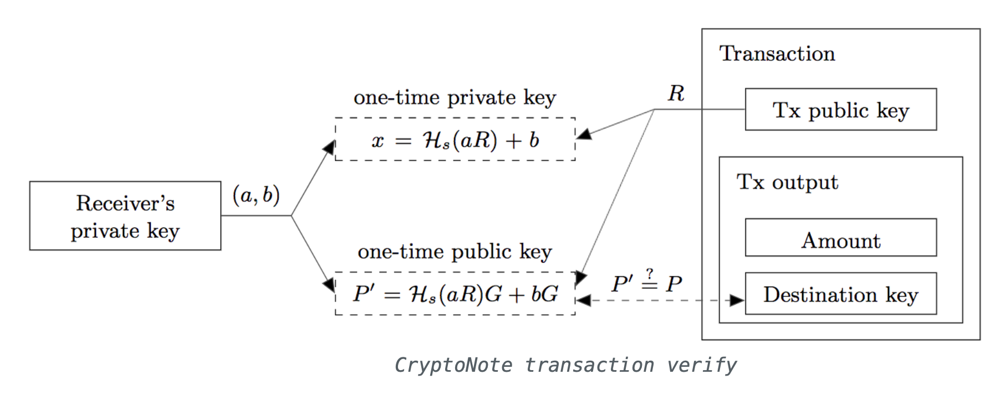
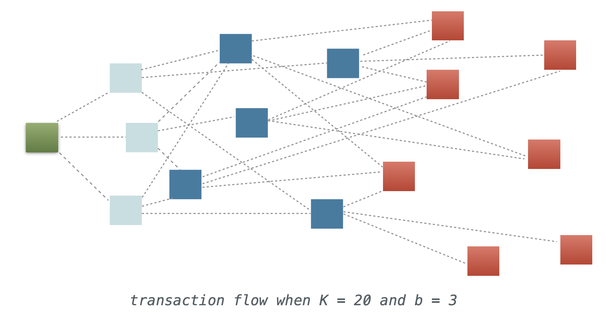
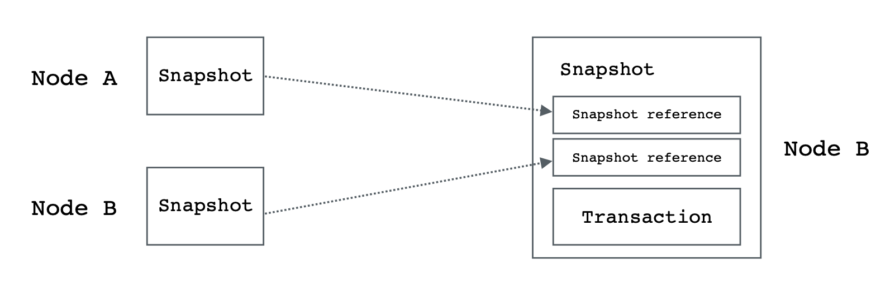
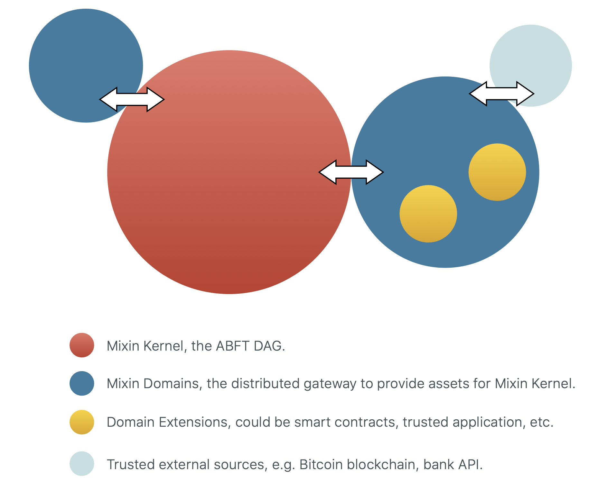

# Mixin 网络  
###### 一个免费的、快如闪电的数字资产点对点交易网络。

## 内容  
1. 动机  
2. 概述  
3. Mixin内核  
3.1. 幽灵输出  
3.2. 异步BFT图  
3.3. 惩罚性PoS  
3.4. 可信的执行环境  
3.5. 轻型认证节点  
4. Mixin域  
4.1. 内核系统调用  
4.2. 标准域接口  
4.3. 域的扩展  
5. 抗攻击性  
5.1 密钥关联  
5.2 存款攻击  
5.3 欺诈性域或密钥泄漏  
5.4 损坏的域或密钥丢失  
5.5 与交易所相比  
6. 治理  
7. XIN - 代币  
8. 结论  

## 1. 动机  

比特币开启了一个金融资源管理的新时代。人们重新获得了自己管理资产的权力，监督资源的分配方式，并将经济从少数人的控制中拯救出来。

如今，无论是专业人士还是普通民众都已经接受了比特币和区块链技术背后的理念，加密货币的用户群正在以越来越快的速度增长。

不幸的是，比特币受到了这种快速增长的影响。最重要的问题是交易能力不足，确认速度慢，交易费用高。

由于比特币网络的不灵活的高度分布性，不可能修复一些关键的缺陷。大多数人没有修复最初的比特币项目，而是试图发明新的项目来解决比特币目前已知的各种不足。

因此，在过去的几年里，以太坊、Monero、Stellar、Cardano和许多新的区块链被发明出来。几乎所有的区块链都试图解决比特币的问题，同时增加一些自己的新功能。然而，它们无法拯救或增强原有的比特币网络，也无法相互操作。

幸运的是，一些比特币信徒正在努力解决比特币的缺点，他们已经提出了几个优秀的解决方案。最重要的一个是Lighting Network[1.0]，它是一个建立在比特币网络上的小额支付系统，不需要对比特币代码进行任何修改。

另一个有趣的解决方案是Blockstream公司的Liquid[1.1]项目，它是一个与比特币区块链并存的联盟式双向挂钩的侧链。

所有这些尝试都在整体上推动了比特币网络，而没有牺牲比特币原始愿景的安全性和分布式性质。比特币的竞争对手也提出了类似的解决方案，例如以太坊的Raiden网络[1.2]。

在本文中，我们试图提出一个可以赋予所有流行的分布式账本的解决方案。我们称这个解决方案为Mixin。Mixin并不是要创造另一种加密货币或任何分布式账本的竞争者。

类似于Lighting Network和Liquid对比特币区块链的作用，Mixin是一个公共分布式账本，允许任何公共分布式账本获得数万亿的TPS，亚秒级最终确认，零交易费，增强隐私和无限扩展性。

## 2. 概述

Mixin由一个理论上永久的内核(Kernel)、许多动态域(Domain)和不同的多用途域扩展(Domain Extension)组成，以制定一个扩展的星形拓扑结构。

这种拓扑结构可能会导致人们担心Mixin是一个中央控制的网络，但由于Kernel本身的工作方式，情况并非如此。

Mixin Kernel是一个高性能的分布式账本，它的唯一职责是验证资产交易。也就是说，单一的永久性Mixin Kernel也是一个分布式网络，就像比特币网络的整体一样。

虽然Mixin Kernel验证了资产交易，但它并不生产任何资产。所有的资产都通过Mixin Domains流经内核。

每个Mixin Domain也是一个分布式账本，其工作是向Mixin Kernel提供资产。这些资产可能是比特币、以太坊或任何其他区块链上的资产，甚至是银行等中央组织。

虽然每个Mixin Domain是为Mixin Kernel提供资产的一个组件，但Kernel本身也是Mixin Domain中的一个组件，以验证和管理其资产。

与大多数现有的基于网关的解决方案不同，Mixin Kernel和Domains都是公共可用的分布式账本，没有中央机构。

从内核到域，Mixin网络都是关于资产和交易的。Mixin域扩展是神奇发生的地方，无论是Ethereum合约、EOS合约，还是在某种程度上受信任的实例上的分布式交易所，或者其他任何东西。

## 3. Mixin内核

Mixin网络的核心是Mixin内核，一个快速的异步拜占庭容错的有向无环图，用来处理有限的Kernel Nodes内的未用交易输出。

### 3.1 幽灵输出

Mixin内核利用比特币的UTXO模型来处理交易，以及CryptoNote[3.1]一次性密钥推导算法来改善隐私，因为不存在地址重用问题。我们称一次性密钥为Ghost Address，与之相关的输出为Ghost Output。

在该算法中，每个私人用户密钥是一对(a，b)的两个不同的椭圆曲线密钥，而公共用户密钥是由(a，b)导出的一对(A，B)的两个公共椭圆曲线密钥。

当Alice想向Bob发送付款时，她得到Bob的公共用户密钥(A，B)，并以一些随机数据推导出至少三个Ghost Address，这就保证了至少为Bob创建三个不同的Ghost Output。

三个幽灵输出的阈值提供了更好的隐私，也迫使输出随机量。在得出Ghost Addresses后，Alice将用CryptoNote算法签署该交易。

注意，为了提高隐私性，Alice被迫挑选随机的UTXO作为交易输入。在交易被签署后，Alice将其发送到Mixin Kernel。

由于Ghost Address功能，只有Bob能识别他的交易，他可以用他的追踪密钥(a，B)解密输出信息。

如果一个交易所希望有一个透明的地址来公开披露它的所有资产信息，它可以只公布它的追踪密钥(a，B)，这样每个人都可以识别它的所有交易，但没有秘钥b就不能消费。

### 3.2 异步BFT图

每个Mixin内核节点需要认捐10,000 XIN，因此由于500,000 XIN的流通供应[3.1]，不会有超过50个内核节点存在。为了防止极端集中的权力，内核只能由至少7个内核节点启动。

内核节点构成了一个松散的网状拓扑结构，负责交易验证和持久性。与区块链不同，Mixin Kernel中没有区块，所有的交易都会尽快以指数形式广播。

一个典型的Mixin Kernel事务的最终处理顺序如下。

1. 当Alice的签名交易被发送到有K(7<=K<50)个节点的Mixin Kernel时，b(b>1)个随机节点(A)会收到它。
2. 每个节点做同样的交易验证。  
1) 输入都是未用的。  
2) 输入和输出金额都在有效范围内。  
3) 验证每个输入的签名。  
4) 输入金额的总和等于输出的总和。  
3. 每个节点都会用验证过的事务创建一个内核快照，快照是存储在内核中构建DAG的基本单元。每个快照由以下部分组成。  
1) 作为有效载荷的交易。  
2) 该节点以前的快照哈希值。  
3) 节点签名。  
4. 签名的快照将尽快广播给另一个b个随机节点（B）。在收到快照并通过步骤2的相同程序验证后，一个新的快照将立即被创建。该快照具有与收到的快照相同的有效载荷，而引用的快照哈希值是该节点中以前的快照哈希值和收到的快照哈希值的一对。
5. 步骤4将重复进行，直到节点得知该交易被至少2/3K的节点批准或拒绝。由于每个快照都引用了父节点，直到节点组A，所以新节点很容易了解到以前的快照是已知快照。这个程序可以避免很多冗余的工作。
6. 在这个过程中，一个交易可以在平均约K/b^2轮内被批准或拒绝，考虑到典型的内核大小，延迟可能在一秒内，概率非常高，并且可以保证在几秒钟内完成。  

由于异步的BFT共识，双花是不可能的。由于UTXO的性质，快照顺序是不相关的，在DAG中可以保证高并发性。

### 3.3 惩罚性PoS

每个Mixin Kernel节点需要10,000 XIN，这大约是网络股份的2%。内核只能在至少有7个节点加入的情况下运行，也就是整个网络股份的15%左右。

内核BFT共识由严格的惩罚性PoS保障，如果一个内核节点被确定为攻击者，它的所有抵押物将被回收到矿池。如果该节点试图广播一个明显的双花快照，它将被确定为攻击者。当一个快照的一些输入状态已经被至少2/3K的节点验证时，它将被认为是明显的。

当一个节点第一次发出攻击快照时，它的股权不会被回收，但它会被网络标记为潜在的攻击者。内核大小将被暂时减少到K-1，而这种减少对潜在的攻击者来说是不可见的。

所有其他节点仍然会对被标记的节点进行广播，但不会考虑其在股权投票中的快照。如果被标记的节点的进一步快照仍然是恶意的，内核将签署一个快照与交易，将所有被标记的节点的抵押品转移到采矿池。

被标记的节点将被永久地从Kernel中移除，它将有一段时间向Mixin Kernel Governance[3.2]提出上诉，而后者是由所有XIN持有人投票决定的。

### 3.4 可信的执行环境

Mixin Kernel已经是一个异步BFT共识DAG。为了确保进一步的安全，Kernel节点必须在可信执行环境[3.3]中运行。具体来说，Mixin使用英特尔SGX[3.4]作为TEE实现。

TEE的执行确保了Mixin Kernel中三个重要的安全和信任因素。  

1. 所有内核节点应运行相同的共识规则集。 
2. 由于英特尔SGX飞地，Mixin Kernel将被信任，即使该Kernel被几个早期的Kernel节点控制。  
3. 分布式领域的通信将更加安全[3.5] 。  

TEE安全的基本逻辑是，英特尔SGX对Mixin系统有一定的信任。

请注意，Mixin Kernel本身是安全的，至少和现有的BFT解决方案一样安全。强制性的英特尔SGX只是让它变得更好。

### 3.5 轻型认证节点

Mixin Light节点是Mixin Kernel的一个简化支付验证(SPV)节点。它通常存储其所有未使用的输出，以方便账户余额查询。

如果Light节点是XIN的持有者，它有机会作为Light Witness。Light Witness将积极监测Mixin Kernel，并将被安排对攻击者的上诉进行自动投票。

Light Witness的投票是以他们的XIN股权为权重的。而投票主要是针对攻击者节点的网络连接状态，以确定攻击者的行为是否是由于网络延迟造成的。

所有Light Witness的投票将与Mixin Kernel治理投票一起进行加权计算，以确定最终的攻击者上诉。如果上诉失败，惩罚将是最终的。

Light Witness被激励去做这些投票，因为如果他们为网络本身做一些工作，他们可以获得挖矿奖励。

## 4. Mixin域

Mixin Domain是一个分布式账本，为Mixin Kernel提供资产。这些资产可以是比特币、以太坊或任何其他区块链上的资产，甚至是银行等中心组织。

### 4.1 内核系统调用

Mixin Kernel提供了一些系统调用来与Domains通信，这也是Kernel和Domains交换状态的唯一方式。这些系统调用被定义为标准的JSON-RPC接口。

JSON-RPC是一个无状态、轻量级的远程过程调用（RPC）协议。它与传输无关，因为这些概念可以在同一进程中使用，通过套接字，通过HTTP，或在许多不同的消息传递环境中使用。它使用JSON（RFC 4627）作为数据格式。

目前Mixin Kernel只实现了该协议的标准HTTPS传输，可用的调用列表如下。

**kernel_registerDomain(内核_注册域)**

注册域并等待内核批准连接。该调用也可以更新域节点。注册的域将被迫在域节点和Kernel整体之间形成一个基于XIN权益的网络。

域注册是一种治理行为，应该与域节点的XIN权益有关。在未来，我们希望在Mixin Kernel中实现一个更自动的域管理策略。升级政策应该始终由所有内核节点和XIN持有者来治理。

参数  

1. UUID - 一个唯一的UUID，在所有其他域中代表该域。  
2. Array - 域节点的透明公钥阵列。  

		params: [“c6d0c728-2624-429b-8e0d-d9d19b6592fa”,
		[“4b7a842ce6050c99450dc30b4e848c4eaffd33915653b472d900f47
		d11722058”,
		“b3aef7b3a998a593c157103d20f9cb17bdbd535f304b17c862e3b35b
		108faeb8”]]

返回

String - 表示注册请求的状态，值为invalid, pending, denied, approved中的一种。

请注意，所有的内核系统调用应该被转发到已知的内核节点，以确保交付。

### 4.2 标准域接口

一个域只有在实现了所有标准域接口的情况下才能被注册到Mixin Kernel。

**domain_getKeyDerivationFunction(获得密钥衍生函数)**

获取特定领域的资产密钥派生函数，这是Mixin Kernel中的一些密钥派生方法之一，可以通过治理进行升级。

支持的方法也可以扩展到一些沙盒式的虚拟机语言，如solidity。

参数

1. UUID - 整个Mixin网络中唯一的资产ID。

		params: [“c6d0c728-2624-429b-8e0d-d9d19b6592fa”]

返回

对象 - 函数名称和参数。

1. method: String - 函数名称，Kernel中预定义的衍生函数名称之一。
2. params: Array - 相对于方法应该使用的参数。

**domain_associatePublicKey(相关的公共密钥)**

将一个Mixin公钥与域所支持的资产关联起来。公钥和域资产关联是将外部资产关联到Mixin内核的法宝。

在公钥与资产关联后，它将得到一个资产特定的公钥，例如比特币公钥。

每当比特币区块链对这个公钥有输出时，该领域将创建一个交易给Mixin公钥。

这样做的原因是Mixin Kernel和Mixin Domain也是一个权益证明网络。除了XIN抵押品，还有额外的英特尔SGX执行所有相关功能。

在域向公钥创建资产交易后，资产将被Mixin Kernel和Mixin Domain锁定。这将导致Mixin Kernel中出现相应的资产闪电交易。

参数

1. String - Mixin的公钥。
2. UUID - 整个Mixin网络中唯一的资产ID。

		params:
		[“4b7a842ce6050c99450dc30b4e848c4eaffd33915653b472d900f47
		d11722058”, “c6d0c728-2624-429b-8e0d-d9d19b6592fa”]

返回

String - 与Mixin公钥相关的资产特定公钥。

**domain_unlockAsset(域_解锁资产)**

解锁资产并转出到外部资源，这类似于加密资产交易所的提款操作。

解锁的操作与关联函数有些类似，它必须由Mixin Kernel和Mixin Domain共同签署，以使其成为网络可接受的有效快照。

Parameters

1. UUID - 整个Mixin网络中唯一的资产ID。
2. String - 外部资产的特定公钥。
3. String - 要解锁的资产数量。
4. String - 外部来源交易的费用。

		params: [“c6d0c728-2624-429b-8e0d-d9d19b6592fa”,
		“15SdoFCiwaoUN4grnhPCoDWxWLcY6ZT68V”, “12.345678”,
		“0.0005”]

返回

String - 外部来源的交易标识，例如交易哈希。

上述三个域接口是所有域必须得到内核认可的。它们通过英特尔SGX可信传输层进行通信，所有加密的私钥都在所有内核节点和域节点中安全地复制。

### 4.3 域的扩展

有了只有交易目的的Mixin内核，以及Mixin域作为资产提供者和通往外部区块链或任何其他来源的网关，Mixin已经成为几乎所有数字资产的最复杂和高性能的分布式账本。

然而，人们需要智能合约，这已经被Ethereum所普及。我们允许对Mixin域进行扩展，这与智能合约类似，但具有更高的稳健性、能力和性能。

Domain Extensions是在由英特尔SGX中的Secure Enclave保障的领域虚拟机中运行的程序，这是一个流行的、安全的可信执行环境。

由于有可能在一个计算单元中运行 "智能合约"，域扩展可以实现许多目标，而这些目标在类似以太坊的东西中几乎是不可能实现的。

1. 更高的性能和更低的延迟，只受硬件的限制。
2. 非确定性交易，例如可信任的随机数。
3. 直接与受信任的外部资源进行交互。

除了这些可信的应用，也可以运行其他流行的分布式虚拟机，如Ethereum或EOS。

## 5. 抗攻击性

由于内核和域节点的PoS和分布式性质，以及英特尔SGX的执行，几乎保证了密钥的安全，不会被泄露。

由于高度分布式的密钥复制和秘密共享机制，加密的私人密钥也被保证不会丢失。

理想情况下，每个资产应该有许多不同的分布式域，这些域由内核管理，并由英特尔SGX安全地执行。

相关的密钥只能从它们在域中产生的地方访问，进一步提高保护程度。

内核将不断平衡不同域中的资产，以进一步防止在不同域中发生几乎不可能发生的私钥泄漏或丢失时的资产损失。

我们将证明Mixin对于数字资产来说是安全的，可以抵御不同的可能攻击载体。

为了简化解释，将只使用比特币作为样本。

### 5.1 密钥关联

密钥关联是授予Mixin公钥与比特币权限的第一步。

每个Mixin公钥Mpub都会有一个比特币公钥Bpub关联，这个关联如何发生和管理决定了密钥的安全性。

Bpub是比特币私钥Bpriv的公开衍生，所以Bpriv是如何生成的决定了Bpub的正确性。

Bpriv纯粹是由Mixin域自己生成的，它将通过(t-n)-阈值秘密共享方案将部分Bpriv转移给内核来保存。如果该域在此过程中是可信任的，那么该关联是绝对安全的。

Intel SGX将执行域的可信任度，即使Intel SGX本身不安全，这几乎是不可能的，本文的以下部分将证明比特币资产在Mixin中也是安全的。

### 5.2 存款攻击

存款是外部资产流入Mixin内核的行为，这是一些BTC加入Mixin的第一步。

由于密钥关联被证明是安全的，而且所有的Mixin域都由Mixin内核管理，如果一些BTC成功提交给内核，它将被保证到正确的Mpub。

所有的比特币存款也将需要一个足够大的域终结阈值，例如，在系统接受资产之前必须有至少12个比特币区块确认。

这样一来，系统有足够的时间来检测欺诈性的域行为，并将在没有任何比特币损失的情况下对其进行惩罚。

域强制英特尔SGX的要求将进一步改善这一点。

### 5.3 欺诈性域或密钥泄漏

Mixin Kernel不断地根据域的行为和抵押品的数量来平衡所有域的资产。如果一个域被破坏或被黑客攻击，泄露的密钥只会造成部分比特币损失。

此外，英特尔SGX将防止欺诈性域的存在，并在大多数情况下使黑客远离。

此外，内核和域总是将大多数比特币加载到一个多签名的Bmpub中，这几乎是不可能被黑的，特别是在正确和透明的分配下。

### 5.4 损坏的域或密钥丢失

就像欺诈域问题一样，域损坏或密钥丢失只会影响少数比特币资产。

由于Mixin治理将确保域作为一个分布式系统被正确实施，所以几乎不可能让域整体受损。

### 5.5 与交易所相比

交易所或其他类型的中央管理比特币解决方案通常将大多数BTC存储在他们的冷库中。

冷库指的是私人钥匙，它永远不会暴露在互联网上，由同一公司的几个人管理。

在安全方面，如果Mixin和交易所都能正确实施解决方案，没有任何错误，Mixin应该被认为是更安全和可信赖的。因为Mixin多签名Bmpub保证由许多不同的人管理，而这些人彼此都不知道，而交易所的钥匙由他们自己的人保管，他们更容易勾结。

除了黑客，交易所可能有机会自己偷钱。这在Mixin上要难得多，甚至是不可能。

此外，由于交易所几乎都是闭源系统，它们经常有一些错误，直到发生黑客攻击时才被发现。

由于Mixin是透明的，代码对所有用户和开发人员开放，以审查和改进，就像Linux被认为比Windows更安全一样，Mixin应该迅速变得比任何闭源交易所更安全。

## 6. 治理

我们尽力使Mixin Network简单地工作而不需要任何强硬的治理，但仍有一些情况可能需要干预。

XIN是决定所有Mixin问题的治理工作的唯一利益相关者。可以投票给治理的向量被列出。

1. 内核节点的处罚金额，主要是在发现双花，或欺诈性资产时评估。
2. 资产和域注册，决定哪些资产将被添加到Mixin内核中。这在未来可能会被自动编程。
3. 外部资产保证，例如，当比特币分叉在域最终阈值之后如何恢复。
4. 内核开发和升级，确定Mixin Kernel规范和升级程序中的一些政策。
5. 社区发展，对社区问题进行投票，如果是关键问题。

## 7. XIN - 代币

XIN是Mixin中许多服务所使用的唯一代币，包括完整的节点抵押，DApp创建和API调用。

要想作为一个完整的节点加入网络，必须承诺至少10,000个XIN代币以建立初始信任。

每一个新的DApp创建行为都会有一个一次性的XIN成本，其数额由DApp声称消耗的资源决定。DApps的Mixin API调用可能会花费一些XIN，这取决于调用的类型和数量。

网络收取的所有XIN惩罚和费用将被回收到采矿池。

1,000,000个永久总额的XIN代币一次性发放给全世界，其中400,000个已经在2017年11月25日至2017年12月25日成功发放给持有人，比率为20 EOS/XIN。

50,000个XIN已被分配给早期Mixin Messenger的采用者。50,000个XIN是为开发团队保留的。

剩余的500,000 XIN将作为所有Mixin完整节点和轻型节点的奖励。

## 8. 结论

我们已经提出了Mixin网络作为一个多层分布式网络。核心层(Mixin Kernel)是一个根据异步BFT有向无环图设计的高度分布式事务性网络。Mixin Domains层是相当可扩展的，对Mixin Kernel的性能没有任何影响。

我们也有一个彻底的安全证明，当管理外部区块链资产时，与几乎所有现有的冷存储解决方案相比，Mixin在日常使用中是安全的。

最重要的是，Mixin并没有发明任何新东西，本文描述的所有技术都已经作为模块被用于现有的成熟项目中。

Mixin Messenger应用程序已经证明了本文在现实世界中是可行的，不像其他大多数项目有美丽的新理论，但没有证据表明他们的工作可以真正在现实世界中实现。

## 附录

1.0 Lighting Network <https://lightning.network>

1.1 Blockstream Liquid <https://blockstream.com/liquid>

1.2 Raiden Network <https://raiden.network>

3.0 CryptoNote <https://cryptonote.org/whitepaper.pdf>

3.1 Section XIN - The Token for details

3.2 Section Governance for details

3.3 Trusted Execution Environment <https://en.wikipedia.org/wiki/Trusted_execution_environment>

3.4 Intel SGX <https://software.intel.com/en-us/sgx-sdk/details>

3.5 Section Kernel System Calls for details